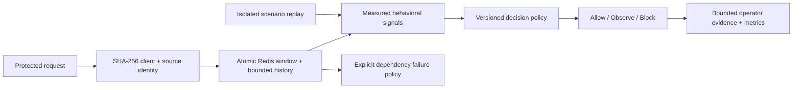

# Sentinel — API Security Workbench

An explainable API abuse detection engine with a working operator console and reproducible attack laboratory. Java 17 · Spring Boot · Redis/Lua · React/TypeScript · Docker · Prometheus.

Sentinel turns a request into inspectable evidence: client and source rate pressure, timing variation, endpoint concentration, a versioned risk decision, and an enforcement action. The console connects to the actual backend; it starts with zero traffic. Replay is clearly separated from live requests.

## Run the complete demo

Requirements: Java 17+, Node 22+, internet for the first dependency installation. Docker is **not** required for the local demo.

```sh
./scripts/demo.sh
```

Open **http://127.0.0.1:8080**. This builds the React console into the executable Spring Boot JAR and runs an explicitly selected `demo` profile with bounded in-memory detection state. No API key is required. The demo binds to loopback.

For frontend development, use two terminals:

```sh
./mvnw spring-boot:run -Dspring-boot.run.profiles=demo
```
```sh
cd frontend
npm ci
npm run dev
```

Open http://127.0.0.1:5173. Vite proxies the console/protected APIs and OpenAPI to port 8080.

## What you can demonstrate

- **Traffic overview:** real counters, retained-decision p95, rolling traffic chart, live/replay separation, storage readiness, and latest signal evidence.
- **Investigations:** search client, source, route, or decision ID; filter actions; inspect a source timeline, signal weights, sample count, policy version, and export JSON evidence including the complete policy snapshot.
- **Attack lab:** seeded organic browsing, catalog scraping, randomized flooding, fingerprint rotation, and scheduled polling. Replay uses the same analyzer with isolated state and virtual timestamps.
- **Evaluation:** a scenario-level confusion matrix against three attack fixtures and two benign controls. The UI makes its synthetic scope explicit.
- **Policies:** enforce/observe, client/source budgets, window, threshold, fail-open/fail-closed, optimistic version checking, and an explicit reset boundary.
- **Operations:** Prometheus counters and latency timer, provisioned Grafana dashboards, readiness, non-root container, CI, OpenAPI, and Docker-backed concurrency tests.

See [the five-minute demo](docs/DEMO.md) and [engineering decisions](docs/ENGINEERING.md).

## Detection contract



Protected routes are `/api/protected/*` and the compatible `/ping` endpoint. Control-plane APIs, assets, health, and metrics bypass abuse scoring. A decision adds `X-Sentinel-Decision`, `X-Sentinel-Action`, and `X-Sentinel-Score`. Blocks return JSON with **429** and `Retry-After`; fail-closed dependency outages return **503**.

| Signal | Trigger | Points |
|---|---|---:|
| Client rate | More than 30 requests in 60s by default | 40 |
| Source rate | More than 120 requests in 60s across fingerprints | 60 |
| Timing regularity | Gap coefficient of variation < 0.15, ≥5 samples | 30 |
| Endpoint repetition | Dominant route ≥85%, ≥5 samples | 20 |

The sum is capped at 100. Exceeding either rate budget is a hard constraint: the score is floored at the configured threshold. A randomized flood cannot evade enforcement by looking behaviorally diverse. Regular polling by itself scores 50 and remains allowed at the default threshold of 60.

Live Redis uses server time and a single atomic Lua invocation. Source and client keys share a Redis Cluster hash tag. UUID sorted-set members preserve same-millisecond concurrent requests. Per-key rate counts saturate at budget + 1, so evidence says **at least** that count. Once the source budget is exhausted, new fingerprint state is not allocated. Histories retain at most 20 samples; keys expire after the rolling window.

## Run with real Redis

Create local credentials without committing them:

```sh
umask 077
printf 'SENTINEL_CONSOLE_TOKEN=%s\nGRAFANA_ADMIN_PASSWORD=%s\n' "$(openssl rand -hex 32)" "$(openssl rand -hex 32)" > .env
docker compose up --build
```

Open http://127.0.0.1:8080 and enter your locally configured console token through **Operator access**. The token remains in browser memory, not local storage. Docker's bridge peer is not loopback, so the token is required even when the published port is local.

Enable monitoring with:

```sh
docker compose --profile observability up --build
```

Prometheus: http://127.0.0.1:9090. Grafana: http://127.0.0.1:3000 (`admin`, the explicit password in `.env`). The provisioned dashboard shows request rate, blocks, dependency failures, and mean decision latency. Redis has no host-exposed port and uses `noeviction` so memory pressure is handled as a visible dependency failure.

## Verify

```sh
cd frontend
npm ci
npm run format:check
npm test
npm run build
cd ..
./mvnw verify
```

Browser regression tests exercise evidence export, observe mode, mobile overflow, and a deliberately delayed replay response arriving after a switch to live traffic:

```sh
# Build the frontend and JAR first. Playwright starts the demo JAR if needed.
cd frontend
npx playwright install chromium
npm run test:e2e
# Alternatively, with an installed Chrome browser:
npm run test:e2e:chrome
```

The full Java suite requires a running Docker daemon for Testcontainers. Core and local-console tests can run without Docker:

```sh
./mvnw test -Dtest=BehaviorAnalyzerTest,DecisionServiceTest,ConsoleIntegrationTest,ConsoleAccessTest
```

Build the console before `mvn package`/`verify` if you want it included in the JAR. Docker builds both stages automatically. CI builds the frontend and runs the full Java suite with real Redis.

## Honest boundaries

- This is deterministic abuse middleware, not a trained ML model, reverse proxy, credential-stuffing classifier, or complete WAF. No external LLM decides whether to block a request.
- Synthetic evaluation demonstrates specific properties, **not production precision or recall**. Traffic characteristics and shared NATs require deployment-specific calibration. There are no invented latency, accuracy, or throughput claims.
- Redis detection state is distributed. Telemetry retains 1,000 decisions per origin **per instance**; counters are lifetime instance totals. Policies are process-local, versioned, and reset on restart. Baseline limits come from application configuration. Durable audit and multi-replica policy distribution are future boundaries.
- The socket peer is authoritative. `X-Forwarded-For` is ignored to prevent spoofing. Behind a reverse proxy, peers will share a source budget unless you implement and test an explicit trusted-proxy strategy.
- Hashed identifiers are pseudonymous, not guaranteed anonymous. No request bodies, tokens, query strings, or raw client IPs are stored in operator telemetry. Numeric path segments normalize to `:id`; other route names may still reveal application context.
- Console APIs allow loopback with a loopback host name by default; configuring `SENTINEL_CONSOLE_TOKEN` requires bearer authentication for every operator, including local users. Mutations require a custom header and do not enable permissive CORS. Use TLS and private networking for deployment; keep Actuator private.
- The local adapter caps source/client cardinality at 2,000 and may evict entries. It is for demonstration, never an automatic failover path. Redis memory still depends on the number of active sources; resource limits and failure policy remain necessary.

The original Redis rate/entropy services remain as legacy examples with their regression tests; the active request pipeline is under `detection/` and `console/`.
